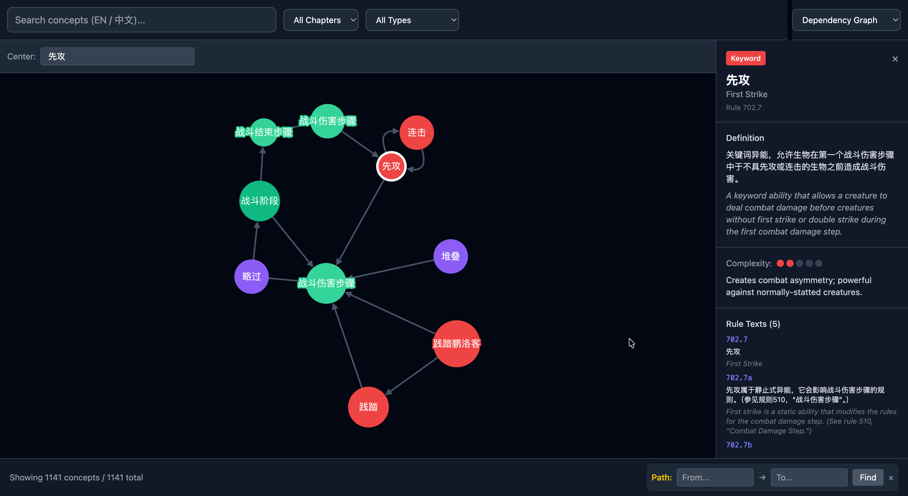

# MTGRuler

**An interactive bilingual knowledge graph of Magic: The Gathering Comprehensive Rules.**

Built to help players learn the rules and to provide game designers with a navigable reference to MTG's rule system.



- 🎴 **1,141 concepts** extracted from the complete Comprehensive Rules
- 🔗 **1,501 relationships** between concepts (dependencies, interactions, references)
- 📖 **3,047 bilingual rule texts** (96% with Chinese translation)
- 🔍 Full-text search in both English and Chinese (CJK-aware)
- 🎨 Interactive Cytoscape.js graph with multiple designer views

## Demo

https://github.com/user-attachments/assets/1845fb94-0d1a-441c-8128-c857514064fe

> 🎬 If the inline player doesn't load, [watch the demo here](docs/media/demo.mp4).

## Architecture

```
┌────────────┬──────────────┬────────────────────┐
│   Parser   │   Server     │      Client        │
│  (Python)  │(Node/Express)│ (React+Cytoscape)  │
├────────────┼──────────────┼────────────────────┤
│ Fetch EN+CN│ :3001 API    │ :5173 UI           │
│ LLM extract│ SQLite FTS5  │ Cytoscape.js       │
│ SQLite out │ BFS path     │ Tailwind CSS v4    │
└────────────┴──────────────┴────────────────────┘
```

**Data flow**: Official EN rules text + community CN translation → Python parser (with LLM-assisted concept extraction) → SQLite database → Express REST API → React + Cytoscape.js UI.

## Features

- **Bilingual search** — Type "Flying" or "飞行" and find the same concept
- **Graph exploration** — Pan, zoom, click nodes to see details
- **Chapter / type filtering** — Narrow to Keywords, Zones, Combat Phase, etc.
- **Detail panel** — Bilingual rule text, complexity rating, related concepts
- **Path query** — "What's the shortest chain of rules from Flying to Combat Damage?"
- **Designer views**:
  - Dependency Graph — center on a mechanic, view its dependencies
  - Complexity Heatmap — nodes colored green→red by complexity
  - Chapter Overview — tree map of rule chapters with stats
  - Interaction Matrix — keyword × keyword interaction grid

## Running the project

### Prerequisites

- **Node.js 20+**
- **Python 3.11+** (only if you want to re-run the parser)
- **SQLite 3.35+** (included with macOS, most Linux distros)

### Quick start (pre-built database included)

The generated `parser/data/concepts.db` is committed to the repo, so you can skip the parser and go straight to running the server + client.

```bash
# 1. Clone the repo
git clone https://github.com/silvery5d/MTGRuler.git
cd MTGRuler

# 2. Start the API server (terminal 1)
cd server
npm install
npx tsx src/index.ts
# → MTGRuler API server running on http://localhost:3001

# 3. Start the client (terminal 2)
cd client
npm install
npm run dev
# → VITE v8 ready at http://localhost:5173
```

Open http://localhost:5173 in your browser. That's it.

### Re-running the parser (optional)

Only needed if you want to regenerate `concepts.db` — e.g., when Wizards publishes an updated rules text, or to try a different LLM.

```bash
# 1. Set up the Python environment
cd parser
python3 -m venv .venv
source .venv/bin/activate
pip install -r requirements.txt

# 2. Configure the LLM
cp ../.env.example ../.env
# Edit ../.env with your API credentials:
#   ANTHROPIC_BASE_URL=https://api.anthropic.com    (or a proxy)
#   ANTHROPIC_API_KEY=sk-ant-...                    (or proxy token)
#   ANTHROPIC_MODEL=claude-sonnet-4-5               (or proxy-provided model)
#
# Works with Anthropic directly or any Anthropic-compatible proxy
# (e.g., Minimax CodePlan, DeepSeek, GLM).

# 3. Run the full pipeline (produces concepts_raw.db)
python run_pipeline.py
#   [1/4] Fetching rules (EN from Wizards, CN from wiki.mtgjudge.cn)
#   [2/4] Aligning EN/CN entries by rule_ref
#   [3/4] Extracting concepts via LLM (caches per-batch, may take 30-60 min)
#   [4/4] Building SQLite database → concepts_raw.db

# 4. Normalize relations + apply curated fixes (produces concepts.db)
python normalize_relations.py   # 150+ relation types → 9 canonical + drops self-loops
python apply_fixes.py            # type/rule_ref/definition fixes surfaced by validation
```

The parser pipeline is idempotent — successful batches are cached in `parser/cache/`, so re-running only retries failed batches.

### Optional: cross-validate the database with a second LLM

An independent DeepSeek-based validator can be run against the curated DB to measure extraction quality or find residual errors. Set `DEEPSEEK_API_KEY` in `.env` first.

```bash
python validate.py --sample 100                          # random 100-concept + 100-relation audit
python validate.py --ids "keyword.flying,zone.stack"     # validate specific concepts
python compare_dbs.py --sample 50                        # side-by-side concepts_raw.db vs concepts.db
python audit_rule_refs.py --suggest-fixes                # text-match rule_ref audit for 701/702 chapters
```

Reports are written under `docs/validation_report*.md` and `docs/db_comparison.md`. The most recent full run (n=300) showed **60% correct / 5.7% wrong** on concepts against the curated DB, vs 41% / 17% on the raw extraction.

## API endpoints

The server exposes a REST API on `http://localhost:3001/api/v1`:

| Endpoint | Purpose |
|----------|---------|
| `GET /health` | Health check |
| `GET /stats` | Totals and aggregations |
| `GET /concepts` | List concepts, filter by `type`, `chapter`, `limit`, `offset` |
| `GET /concepts/:id` | Concept detail with rule texts and related concepts |
| `GET /concepts/:id/neighbors?depth=N` | BFS neighbors of a concept |
| `GET /relations` | List relations, filter by `type`, `source`, `target` |
| `GET /search?q=<query>&type=<type>` | Bilingual FTS5 search (CJK-aware) |
| `GET /path?from=<id>&to=<id>` | Shortest path between two concepts |
| `GET /graph?chapter=<N>` | Subgraph for a chapter (Cytoscape format) |
| `GET /graph?center=<id>&depth=<N>` | Ego-centric subgraph |

Example:
```bash
curl "http://localhost:3001/api/v1/search?q=飞行" | jq
curl "http://localhost:3001/api/v1/concepts/keyword.flying" | jq
```

## Data sources

- **English**: [Official Comprehensive Rules](https://magic.wizards.com/en/rules) from Wizards of the Coast
- **Chinese**: Community translation at [wiki.mtgjudge.cn/cr](https://wiki.mtgjudge.cn/cr)

## Tech stack

- **Parser**: Python 3.14, httpx, beautifulsoup4, anthropic SDK, python-dotenv
- **Server**: Node.js, TypeScript, Express 4, better-sqlite3, vitest
- **Client**: React 19, TypeScript, Vite 8, Cytoscape.js, react-cytoscapejs, Tailwind CSS v4

## Project structure

```
MTGRuler/
├── parser/                   # Python data pipeline
│   ├── fetch_rules.py        # EN rules download + CN wiki scraping
│   ├── preprocess.py         # Align EN/CN entries by rule_ref
│   ├── extract.py            # LLM-assisted concept extraction (recursive split-on-failure)
│   ├── build_db.py           # SQLite build + FTS5 setup + CJK tokenization
│   ├── run_pipeline.py       # Orchestrator
│   ├── normalize_relations.py # 150+ relation types → 9 canonical (+ direction fix)
│   ├── apply_fixes.py        # Curated type/rule_ref/definition fixes (idempotent)
│   ├── validate.py           # DeepSeek cross-validator
│   ├── audit_rule_refs.py    # Text-match rule_ref consistency audit
│   ├── compare_dbs.py        # Before/after DB quality comparison
│   ├── cache/                # Per-batch LLM response cache
│   └── data/
│       ├── raw/              # Raw rule text files (gitignored)
│       ├── processed/        # Structured intermediates (gitignored)
│       ├── concepts_raw.db   # Raw LLM extraction output (committed)
│       └── concepts.db       # Curated final DB — what the server loads (committed)
├── server/              # Node.js REST API
│   ├── src/
│   │   ├── index.ts     # Express entry
│   │   ├── db.ts        # better-sqlite3 connection
│   │   ├── types.ts     # Shared types
│   │   ├── routes/      # concepts, relations, search, path, graph, stats
│   │   └── utils/       # BFS pathfinder
│   └── tests/           # Vitest tests (20 total)
├── client/              # React + Cytoscape.js UI
│   └── src/
│       ├── App.tsx      # Main shell
│       ├── components/  # GraphView, SearchBar, DetailPanel, PathQuery, etc.
│       │   └── DesignerView/  # HeatMap, ChapterOverview, InteractionMatrix, DependencyGraph
│       ├── hooks/       # useGraph, useSearch
│       ├── services/    # API client
│       ├── styles/      # Cytoscape stylesheets
│       └── types/       # Shared types
├── docs/
│   └── superpowers/
│       ├── specs/       # Design specifications
│       └── plans/       # Implementation plans (Phase 1-3)
└── .env.example         # LLM configuration template
```

## Known limitations

1. **LLM-generated relation types are not normalized.** The spec defines 8 relation types (CONTAINS, DEPENDS_ON, REFERENCES, OCCURS_IN, MODIFIES, INTERACTS_WITH, MOVES_TO, PATTERN_OF) but the LLM sometimes invents additional ones (CREATES, USES, IS_TYPE, etc.). The graph still displays them correctly but the Interaction Matrix designer view expects `INTERACTS_WITH` specifically and may be sparse.

2. **Some concepts are mis-classified.** For example, a few multiplayer variants like "Emperor" got tagged as `Keyword` instead of `Concept`. A manual curation pass would fix this.

3. **SQLite FTS5 CJK workaround.** The `unicode61` tokenizer doesn't segment consecutive CJK characters. The parser inserts spaces between Han characters at index time, and the server's `/search` route does the same at query time before calling `MATCH`. This lets bilingual FTS work without a custom tokenizer.

4. **Parser reliability depends on LLM stability.** Some batches fail with truncated or empty responses; the parser recovers by recursively splitting batches in half (40 → 20 → 10 → 5). A small fraction of the original rule coverage may still be lost.

## License

MIT — see [LICENSE](LICENSE)

## Contributing

Contributions welcome! The three sub-projects can be worked on independently:

- **parser/** — improve LLM prompts, add custom extraction rules, fix mis-classifications
- **server/** — add endpoints, improve CJK tokenization, add caching
- **client/** — new designer views, better layouts, mobile responsive, animations

When submitting a PR, please:
1. Add tests where applicable (`npx vitest` in `server/`)
2. Keep commits focused and well-described
3. Update this README if you change user-facing behavior

## Acknowledgments

- **Wizards of the Coast** for publishing the Comprehensive Rules
- **wiki.mtgjudge.cn** community for the Chinese translation
- **Cytoscape.js** for the graph rendering engine
